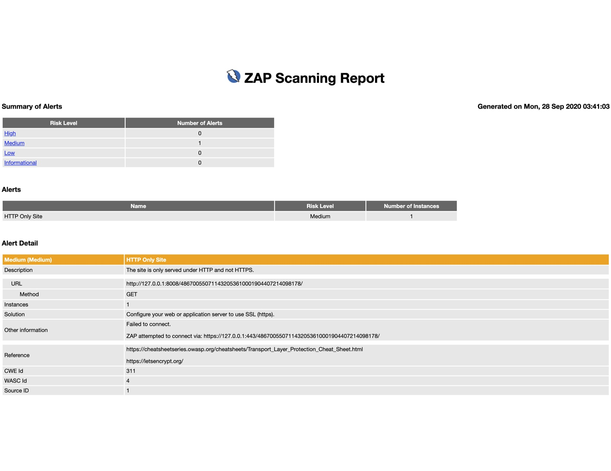

# Security testing and DDEV-Local

DevSecOps has become a movement that, amongst other things, shifts security awareness and testing ‘left’, to be incorporated earlier and continuously throughout the SDLC. It empowers developers to test for security flaws, primarily using Dynamic Application Security Testing (DAST) tools, and view the results in real-time. This minimizes the impact of discovering security flaws and allows for a less painful correction in the latter stages of development. 

DDEV-Local enables developers to get up and working on projects faster, and DDEV-Live offers scalable infrastructure to seamlessly run those applications at scale. As part of the DDEV development process it's possible to easily incorporate a simple DAST framework that allows developers to test for security flaws and review those results at any stage of their development, from the first line of code through to testing as part of the build. 


## Requirements

* Docker
* Docker-compose

## Usage

Just pass a URL to any one of the three scripts. Typically this is run after executing ```ddev launch``` and the url is ```[site-description].ddev.site```

**- Baseline Scan**
```shell
./run-docker-baseline.sh https://www.example.com/
```
Estimated duration: <2 mins
Tools: OWASP ZAP (baseline.py), nmap 

**- Extended Scan**
```shell
./run-docker-extended.sh https://www.example.com/
```
Estimated duration: 10-15 mins
Tools: OWASP-ZAP, nmap, Nikkto, sqlmap

**- Full / Active Scan**
```shell
./run-docker-full.sh https://www.example.com/
```
Estimated duration: 15-60 mins
Tools: OWASP-ZAP, nmap, Nikkto, sqlmap, owasp-depenency-check

**NOTE:** Testing will run against the host. Estimated times are below, but are highly dependent on the size of your project / site:

## View static results
Static HTML showing test results and suggested corrective actions can be found in the repo. Exmaple: View output.html in the local repo

## View searchable results in Kibana.
ELK is launched after the tests complete and will be running on port 5601. Browse to: http://localhost:5601  (username: elastic, pass: changeme)

